<div align="center">
  <a href="https://cjjutba.com" target="_blank">
    
  </a>
</div>

<div align="center">
  
  
  
  [](https://github.com/cjjutba)
  [](https://linkedin.com/in/cjjutba)
  [](https://twitter.com/cjjutba)
</div>

---

# 💫 Frontend Developer & Problem Solver

<div align="center">
  
</div>

<table style="border: none; border-collapse: collapse; width: 100%;" border="0" cellspacing="0" cellpadding="0">
<tr style="border: none;">
<td width="50%" valign="top" style="border: none; padding: 20px;">

### 🚀 Current Focus
```javascript
const developer = {
  currentProject: "cjjutba.com",
  learning: ["Advanced React Patterns", "Web3 Integration"],
  expertise: ["React", "TypeScript", "Next.js", "Performance Optimization"],
  architecture: "Enterprise-grade solutions"
};
```

### 📊 Professional Highlights
<div style="display: flex; flex-direction: column; gap: 12px;">

**🔭 Currently Building**  
`cjjutba.com` - Next-generation web platform

**📚 Learning Journey**  
`Advanced React Patterns` • `Web3 Integration` • `Microservices`

**🎯 Expertise Areas**  
`React` • `TypeScript` • `Next.js` • `Performance Optimization`

**📁 Portfolio Hub**  
[🌐 cjjutba.com/projects](https://cjjutba.com/projects)

**✍️ Technical Insights**  
[📝 cjjutba.com/blog](https://cjjutba.com/blog)

**🤝 Let's Connect**  
[📧 hello@cjjutba.com](mailto:hello@cjjutba.com)

</div>

### 🛠️ Tech Arsenal
```yaml
Frontend: React, Next.js, TypeScript, Tailwind CSS
State: Redux Toolkit, Zustand, React Query
Testing: Jest, Cypress, React Testing Library
Tools: Vite, Webpack, Docker, Git
Cloud: Vercel, AWS, Cloudflare
```

</td>
<td width="50%" align="center" style="border: none; padding: 20px;">

<div align="center" style="position: relative;">
  
</div>

<br/>

### 📈 Development Philosophy

```mermaid
graph TD
    A[💡 Innovation] --> B[🎯 User-Centric Design]
    B --> C[⚡ Performance First]
    C --> D[🔒 Security Focused]
    D --> E[♻️ Scalable Architecture]
    E --> A
```

<div align="center">



</div>

<div align="center" style="margin-top: 20px;">

</div>

</td>
</tr>
</table>

---

<div align="center">
  
</div>

## Technologies I Use

<div align="center">
  
  
  
  
  
  
  
  
  
  
  
  
  
  
  
  
  
  
  
  
  
  
  
  
  
  
  
  
  
</div>

---

## 📊 Weekly Development Breakdown

<!--START_SECTION:waka-->
```text
Total Time: 41 hrs 2 mins

TypeScript   36 hrs 1 min   ████████████████████▓░░░░   86.80 %
JSON         1 hr 46 mins   ▓░░░░░░░░░░░░░░░░░░░░░░░░   04.26 %
JavaScript   1 hr 28 mins   █░░░░░░░░░░░░░░░░░░░░░░░░   03.54 %
Other        28 mins        ▒░░░░░░░░░░░░░░░░░░░░░░░░   01.14 %
CSS          21 mins        ▒░░░░░░░░░░░░░░░░░░░░░░░░   00.85 %
```
<!--END_SECTION:waka-->

---

## 📈 Stats

<div align="center">

### Most Used Languages


### WakaTime Stats


</div>

---

## 🚀 CJ Jutba's GitHub Stats

<div align="center">
<table>
<tr>
<td>

**⭐ Total Stars Earned:** `151`  
**⏰ Total Commits (2025):** `151`  
**🔀 Total PRs:** `32`  
**🐛 Total Issues:** `0`  
**📊 Contributed to (last year):** `0`

</td>
<td>

**📈 Total Contributions**  
`477`  
*Jun 13 - Present*

**🔥 Current Streak**  
`2`  
*Aug 6 - Aug 7*

**⚡ Longest Streak**  
`33`  
*Jun 22 - Jul 24*

</td>
</tr>
</table>


</div>

---