<!-- Clickable Cover Photo -->
<div align="center">
  <a href="https://cjjutba.com" target="_blank">
    
  </a>
</div>

<br>

<!-- Social Links and Profile Views in One Row -->
<div align="center">
  <table width="100%">
    <tr>
      <td align="left">
        <!-- GitHub Badge -->
        <a href="https://github.com/cjjutba" target="_blank">
          
        </a>
        &nbsp;
        <!-- LinkedIn Badge -->
        <a href="https://linkedin.com/in/cjjutba" target="_blank">
          
        </a>
        &nbsp;
        <!-- Instagram Badge -->
        <a href="https://instagram.com/cjjutba" target="_blank">
          
        </a>
      </td>
      <td align="right">
        <!-- Profile Views -->
        
      </td>
    </tr>
  </table>
</div>

<br>

<!-- Contact and Status Row -->
<div align="center">

<!-- Portfolio Badge -->
<a href="https://cjjutba.com" target="_blank">
  
</a>
&nbsp;&nbsp;
<!-- Email Badge -->
<a href="mailto:hello@cjjutba.com">
  
</a>
&nbsp;&nbsp;
<!-- Availability Status -->


</div>

---

## 👨‍💻 About Me

**Computer Engineering graduate** specializing in **front-end development**. I transform complex problems into beautiful, intuitive, and responsive user interfaces. My engineering background gives me a unique perspective—I don't just build what looks good, I engineer UIs that are performant, accessible, and integrate seamlessly with backend services.

```typescript
const cjJutba = {
  role: "Frontend Developer",
  education: "Computer Engineering",
  location: "Plaridel, Misamis Occidental, Philippines",
  focus: ["UI/UX Implementation", "Performance Optimization", "Accessibility"],
  currentlyLearning: ["Next.js 14", "Advanced React Patterns", "Web3 Integration"],
  availableFor: ["Full-time opportunities", "Freelance projects", "Collaborations"]
};
```

---

## 🛠️ Technology Stack

<div align="center">

### 💻 Frontend Development


### 🎨 Styling & UI


### 🔧 Development Tools


### 🚀 Deployment & Hosting


</div>

---

## 📊 GitHub Statistics

<div align="center">
  
<table>
<tr>
<td>
  
[](https://github.com/cjjutba)

</td>
<td>

[](https://github.com/cjjutba)

</td>
</tr>
</table>

[](https://github.com/cjjutba)

</div>

---

## 💼 Experience Highlights

<div align="center">

| 🎯 **Metric** | 📈 **Achievement** |
|---------------|-------------------|
| **Projects Delivered** | 15+ successful web applications |
| **Client Satisfaction** | 100% positive feedback rate |
| **Development Focus** | Modern React ecosystem |
| **Specialization** | Responsive UI/UX implementation |
| **Performance** | Optimized for Core Web Vitals |

</div>

---

## 🎯 Core Expertise

<table>
<tr>
<td width="50%">

### 🎨 Frontend Development
- **⚛️ React Ecosystem** - Hooks, Context, State Management
- **📘 TypeScript** - Type-safe development
- **📱 Responsive Design** - Mobile-first approach
- **⚡ Performance Optimization** - Fast loading times
- **♿ Accessibility** - WCAG compliant interfaces

</td>
<td width="50%">

### 🔧 Development Practices
- **✨ Clean Code** - Maintainable and readable
- **🧩 Component Architecture** - Reusable UI components
- **🔄 Version Control** - Git workflow management
- **🧪 Testing** - Quality assurance focused
- **📚 Documentation** - Well-documented projects

</td>
</tr>
</table>

---

## 📈 Current Learning Journey

```mermaid
graph LR
    A[🔥 Advanced React Patterns] --> B[⚡ Next.js 14 Features]
    B --> C[🚀 Web Performance Optimization]
    C --> D[🌐 Web3 Integration]
    D --> E[🛠️ Node.js Backend]
    
    style A fill:#3b82f6,stroke:#ffffff,color:#ffffff
    style B fill:#000000,stroke:#ffffff,color:#ffffff
    style C fill:#61DAFB,stroke:#000000,color:#000000
    style D fill:#F16822,stroke:#ffffff,color:#ffffff
    style E fill:#339933,stroke:#ffffff,color:#ffffff
```



---

## 💡 Philosophy

> **"I don't just write code—I craft experiences."** Every line of CSS and JavaScript is written with the user in mind, focusing on performance, accessibility, and creating a seamless digital journey.

---

## 🤝 Let's Collaborate

I'm always open to discussing:

- 🚀 **Innovative frontend projects**
- 💼 **Full-time opportunities**
- 🤝 **Open source contributions**
- 🎓 **Knowledge sharing**

<div align="center">

[](mailto:hello@cjjutba.com?subject=Let's%20Connect%20-%20GitHub)

</div>

---

## 🏆 GitHub Achievements

<div align="center">

[](https://github.com/cjjutba)

</div>

---

## 📫 Contact Information

<div align="center">

<table>
<tr>
<td align="center" width="25%">
<br>
<a href="https://cjjutba.com"><strong>cjjutba.com</strong></a>
</td>
<td align="center" width="25%">
<br>
<a href="mailto:hello@cjjutba.com"><strong>hello@cjjutba.com</strong></a>
</td>
<td align="center" width="25%">
<br>
<strong>Plaridel, Misamis Occidental</strong>
</td>
<td align="center" width="25%">
<br>
<strong>Open for Opportunities</strong>
</td>
</tr>
</table>

</div>

---

<div align="center">

### 🎯 **Ready to build something amazing together?**

[](https://cjjutba.com)
[](mailto:hello@cjjutba.com)

**Made with ❤️ by [CJ Jutba](https://github.com/cjjutba)**  
*Crafting beautiful user experiences, one component at a time.*

</div>